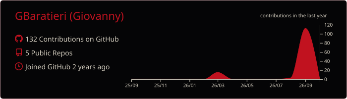
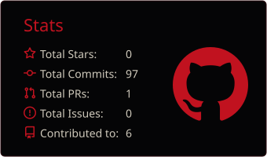
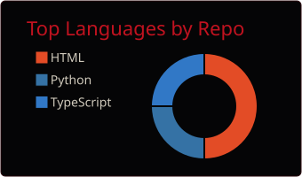
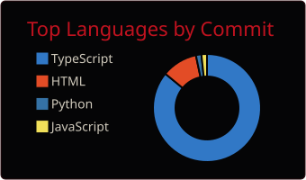
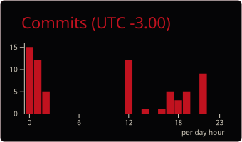

  

<h1 align="center">Giovanny Baratieri</h1>

  <i>Software developer · Web with TypeScript and Next.js · Computer vision with Python</i>

  
  
  

<h2 align="center">⚔️ About me</h2>

- 🏰 Building **[Linka](https://github.com/GBaratieri/Linka)**: a SaaS platform that generates and maintains a Brazilian micro-business's landing page from a single link (Instagram or Google).
- 🧪 On Linka, I apply automated testing (Vitest), row-level security (RLS) in Postgres and documented technical decisions in `docs/`.
- 👁️ Exploring **computer vision**: real-time vehicle detection and tracking with YOLOv8 and ByteTrack.

  

<h2 align="center">🛡️ Arsenal</h2>

  

<h2 align="center">📜 Featured projects</h2>

| Project | About |
| :-- | :-- |
| **[Linka](https://github.com/GBaratieri/Linka)** TypeScript · Next.js · Supabase · Tailwind · Zod · Vitest | SaaS platform that generates and maintains a small business's landing page from a single Instagram or Google link. |
| **[vehicle-counter](https://github.com/GBaratieri/vehicle-counter)** Python · OpenCV · Ultralytics | Real-time vehicle counting with YOLOv8 and ByteTrack, in a three-thread pipeline (capture, inference and display). |
| **[StudioFlow](https://github.com/GBaratieri/studioflow)** HTML · CSS · JavaScript | Web dashboard for managing clients, professionals, services and appointments at beauty studios and barbershops (front-end prototype). |

<h2 align="center">📊 Stats</h2>

  

  
  

  
  

<i>Per aspera ad astra</i>

  

